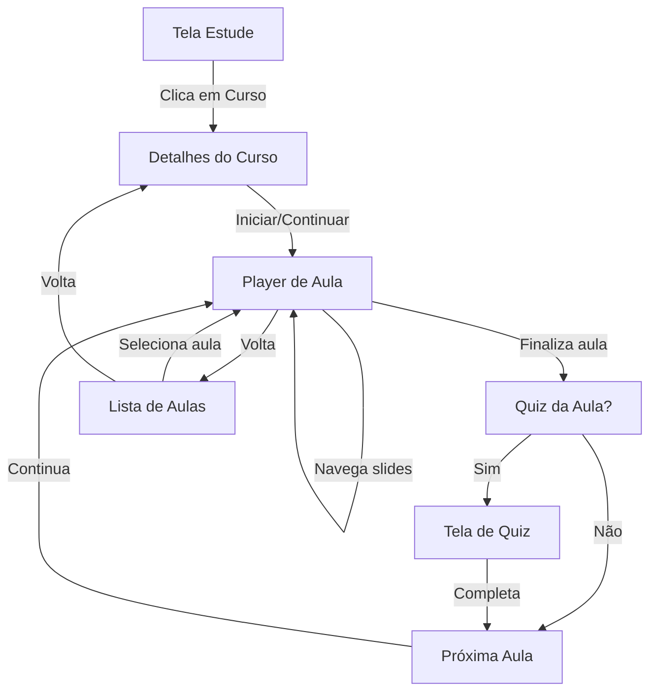

# Especificação UX/UI: Módulo de Cursos Espíritas

**Data de Criação**: 03/01/2026  
**Objetivo**: Definir todas as telas necessárias para o módulo de Cursos e criar prompts para Stitch AI

---

## 📊 Análise das Interfaces de Dados

### Estrutura de Cursos (do Quiz-Web):

```typescript
ICourse {
  id, title, description, workloadMinutes, releaseYear,
  difficultyLevel: 'Iniciante' | 'Intermediário' | 'Avançado',
  categoryId, author, lessonCount
}

ILesson {
  id, courseId, title, order, quizId?, slides[],
  durationMinutes, isCompleted, source?, chapter?
}

ISlide {
  slideType, title, content, imagePrompt?,
  highlights[], references { kardeciana?, biblica? }
}

IUserCourseProgress {
  userId, courseId, lastLessonId, completedLessons[],
  completionPercentage, completedAt?
}
```

---

## 🎯 Jornada do Usuário



---

## 📱 Telas Necessárias (7 telas)

### 1. ✅ Tela Estude (Dashboard) - JÁ ESPECIFICADA

- Ver `study_screen_progress_spec.md`

### 2. 🆕 Catálogo de Cursos

**Rota:** `CoursesCatalog`  
**Acesso:** Card "Cursos Espíritas" na Biblioteca

### 3. 🆕 Detalhes do Curso

**Rota:** `CourseDetails`  
**Acesso:** Clique em card de curso

### 4. 🆕 Lista de Aulas (Currículo)

**Rota:** `CourseCurriculum`  
**Acesso:** Botão "Ver Aulas" nos detalhes

### 5. 🆕 Player de Aula (Slides)

**Rota:** `LessonPlayer`  
**Acesso:** Clique em aula ou botão "Continuar"

### 6. 🆕 Quiz da Aula

**Rota:** `LessonQuiz`  
**Acesso:** Ao finalizar aula (se houver quiz)

### 7. 🆕 Certificado de Conclusão

**Rota:** `CourseCertificate`  
**Acesso:** Ao completar 100% do curso

---

## 🎨 Especificação Detalhada das Telas

---

## TELA 2: Catálogo de Cursos

### Objetivo:

Exibir todos os cursos disponíveis com filtros e busca.

### Layout:

```
┌─────────────────────────────────────┐
│ ← Cursos Espíritas                 │
│                                     │
│ [Barra de Busca]                    │
│                                     │
│ Filtros: [Todos] [Iniciante] [...] │
│                                     │
│ ┌─────────────────────────────────┐ │
│ │ [Imagem do Curso]               │ │
│ │ Introdução ao Espiritismo       │ │
│ │ 12 aulas • 180 min • Iniciante  │ │
│ │ ████████░░ 45%                  │ │ ← Se em progresso
│ └─────────────────────────────────┘ │
│                                     │
│ ┌─────────────────────────────────┐ │
│ │ [Imagem do Curso]               │ │
│ │ Mediunidade e Desenvolvimento   │ │
│ │ 8 aulas • 120 min • Intermediário│ │
│ └─────────────────────────────────┘ │
│                                     │
└─────────────────────────────────────┘
```

### Componentes:

- **Header**: Título + botão voltar
- **SearchBar**: Busca por título/autor
- **FilterChips**: Todos, Iniciante, Intermediário, Avançado
- **CourseCard**: Card vertical com:
  - Imagem (16:9, 320x180px)
  - Título (bold, 16px)
  - Metadados (aulas, duração, nível)
  - Barra de progresso (se iniciado)

### Estados:

- **Loading**: Skeleton cards
- **Empty**: "Nenhum curso encontrado"
- **Error**: Mensagem de erro com retry

---

## TELA 3: Detalhes do Curso

### Objetivo:

Mostrar informações completas do curso antes de iniciar/continuar.

### Layout:

```
┌─────────────────────────────────────┐
│ ← [Imagem Hero do Curso]            │
│                                     │
│ Introdução ao Espiritismo           │
│ Por Allan Kardec                    │
│                                     │
│ ████████████░░░░ 75%                │ ← Se em progresso
│                                     │
│ ┌─────────────────────────────────┐ │
│ │ 📚 12 aulas                     │ │
│ │ ⏱️ 180 minutos                  │ │
│ │ 📊 Iniciante                    │ │
│ │ 📅 2024                         │ │
│ └─────────────────────────────────┘ │
│                                     │
│ Sobre o Curso                       │
│ Compreenda os principais conceitos  │
│ e doutrinas que fundamentam o       │
│ Espiritismo...                      │
│                                     │
│ ┌─────────────────────────────────┐ │
│ │        CONTINUAR CURSO          │ │ ← Se em progresso
│ └─────────────────────────────────┘ │
│ ┌─────────────────────────────────┐ │
│ │        VER AULAS                │ │
│ └─────────────────────────────────┘ │
│                                     │
└─────────────────────────────────────┘
```

### Componentes:

- **Hero Image**: Imagem full-width com gradiente
- **CourseHeader**: Título + autor overlay na imagem
- **ProgressBar**: Barra de progresso (se iniciado)
- **StatsGrid**: Grade 2x2 com ícones
- **Description**: Texto expandível
- **ActionButtons**:
  - "CONTINUAR CURSO" (verde, se iniciado)
  - "INICIAR CURSO" (verde, se novo)
  - "VER AULAS" (outline)

### Estados Condicionais:

- **Novo**: Botão "INICIAR CURSO"
- **Em Progresso**: Barra + "CONTINUAR CURSO"
- **Completo**: Badge "✓ Concluído" + "REVISAR CURSO"

---

## TELA 4: Lista de Aulas (Currículo)

### Objetivo:

Exibir todas as aulas do curso com status de conclusão.

### Layout:

```
┌─────────────────────────────────────┐
│ ← Aulas do Curso                    │
│                                     │
│ Introdução ao Espiritismo           │
│ 8 de 12 aulas concluídas            │
│                                     │
│ ┌─────────────────────────────────┐ │
│ │ ✓ 1. O que é Espiritismo        │ │
│ │    15 min • Concluída           │ │
│ └─────────────────────────────────┘ │
│                                     │
│ ┌─────────────────────────────────┐ │
│ │ ▶ 2. Os Princípios Básicos      │ │ ← Em andamento
│ │    18 min • 8 min restantes     │ │
│ └─────────────────────────────────┘ │
│                                     │
│ ┌─────────────────────────────────┐ │
│ │ 🔒 3. A Vida Futura             │ │ ← Bloqueada
│ │    20 min • Bloqueada           │ │
│ └─────────────────────────────────┘ │
│                                     │
└─────────────────────────────────────┘
```

### Componentes:

- **CourseProgress**: Título + "X de Y aulas concluídas"
- **LessonCard**: Card com:
  - Ícone de status (✓, ▶, 🔒)
  - Número + título
  - Duração + status
  - Badge de quiz (se houver)

### Estados da Aula:

- **Concluída**: ✓ verde, fundo levemente verde
- **Em Andamento**: ▶ amarelo, mostra tempo restante
- **Disponível**: Sem ícone, clicável
- **Bloqueada**: 🔒 cinza, não clicável

### Lógica de Desbloqueio:

- Aulas sequenciais: só desbloqueia após completar anterior
- Primeira aula sempre desbloqueada

---

## TELA 5: Player de Aula (Slides)

### Objetivo:

Exibir conteúdo da aula em formato de slides navegáveis.

### Layout:

```
┌─────────────────────────────────────┐
│ ← Aula 2: Os Princípios Básicos  ⋮ │
│                                     │
│ ┌─────────────────────────────────┐ │
│ │                                 │ │
│ │   [Conteúdo do Slide]           │ │
│ │                                 │ │
│ │   • Ponto 1                     │ │
│ │   • Ponto 2                     │ │
│ │   • Ponto 3                     │ │
│ │                                 │ │
│ │   [Imagem opcional]             │ │
│ │                                 │ │
│ └─────────────────────────────────┘ │
│                                     │
│ ┌─────────────────────────────────┐ │
│ │ 💡 Destaques                    │ │
│ │ Ponto importante sobre...       │ │
│ └─────────────────────────────────┘ │
│                                     │
│ ┌─────────────────────────────────┐ │
│ │ 📖 Referências                  │ │
│ │ Kardeciana: O Livro dos Esp...  │ │
│ │ Bíblica: João 3:16              │ │
│ └─────────────────────────────────┘ │
│                                     │
│ ●●●○○○○ 3/7                         │ ← Indicador de slides
│                                     │
│ [← Anterior]      [Próximo →]      │
│                                     │
└─────────────────────────────────────┘
```

### Componentes:

- **Header**: Título da aula + menu (⋮)
- **SlideContent**: Área principal scrollável
- **HighlightCard**: Card de destaque (opcional)
- **ReferenceCard**: Card de referências (opcional)
- **SlideIndicator**: Bolinhas + contador
- **NavigationButtons**: Anterior/Próximo

### Tipos de Slide:

1. **Texto**: Título + conteúdo markdown
2. **Imagem**: Título + imagem + legenda
3. **Destaque**: Card especial com ícone
4. **Referência**: Card de citações

### Navegação:

- **Swipe horizontal**: Navega entre slides
- **Botões**: Anterior/Próximo
- **Último slide**: Botão "FINALIZAR AULA"

### Menu (⋮):

- Índice de slides
- Marcar como concluída
- Compartilhar aula
- Ajustar tamanho da fonte

---

## TELA 6: Quiz da Aula

### Objetivo:

Testar conhecimento após completar a aula.

### Layout:

```
┌─────────────────────────────────────┐
│ ← Quiz: Os Princípios Básicos       │
│                                     │
│ Pergunta 2 de 5                     │
│ ████░░░░░░ 40%                      │
│                                     │
│ O que é o perispírito segundo       │
│ o Espiritismo?                      │
│                                     │
│ ┌─────────────────────────────────┐ │
│ │ A) O corpo físico               │ │
│ └─────────────────────────────────┘ │
│                                     │
│ ┌─────────────────────────────────┐ │
│ │ B) O corpo fluídico semi-material│ │
│ └─────────────────────────────────┘ │
│                                     │
│ ┌─────────────────────────────────┐ │
│ │ C) A alma imortal               │ │
│ └─────────────────────────────────┘ │
│                                     │
│ ┌─────────────────────────────────┐ │
│ │ D) O pensamento                 │ │
│ └─────────────────────────────────┘ │
│                                     │
│          [CONFIRMAR]                │
│                                     │
└─────────────────────────────────────┘
```

### Componentes:

- **QuizHeader**: Título + contador
- **ProgressBar**: Progresso do quiz
- **QuestionCard**: Pergunta em destaque
- **AnswerOption**: Botão de alternativa
- **ConfirmButton**: Confirmar resposta

### Estados da Resposta:

- **Não selecionada**: Fundo card, borda sutil
- **Selecionada**: Borda verde, fundo levemente verde
- **Correta**: ✓ verde, fundo verde
- **Incorreta**: ✗ vermelho, fundo vermelho
- **Correta (não selecionada)**: ✓ verde outline

### Fluxo:

1. Seleciona resposta
2. Clica "CONFIRMAR"
3. Mostra feedback (certo/errado)
4. Exibe explicação (se houver)
5. Botão "PRÓXIMA PERGUNTA"
6. Ao final: Tela de resultado

---

## TELA 7: Certificado de Conclusão

### Objetivo:

Parabenizar e permitir compartilhar certificado.

### Layout:

```
┌─────────────────────────────────────┐
│                                     │
│         🎉 Parabéns!                │
│                                     │
│ Você concluiu o curso               │
│ Introdução ao Espiritismo           │
│                                     │
│ ┌─────────────────────────────────┐ │
│ │ ┌─────────────────────────────┐ │ │
│ │ │   CERTIFICADO DE CONCLUSÃO  │ │ │
│ │ │                             │ │ │
│ │ │   [Nome do Usuário]         │ │ │
│ │ │                             │ │ │
│ │ │   Concluiu com sucesso o    │ │ │
│ │ │   curso "Introdução ao      │ │ │
│ │ │   Espiritismo"              │ │ │
│ │ │                             │ │ │
│ │ │   12 aulas • 180 minutos    │ │ │
│ │ │                             │ │ │
│ │ │   03/01/2026                │ │ │
│ │ └─────────────────────────────┘ │ │
│ └─────────────────────────────────┘ │
│                                     │
│ ┌─────────────────────────────────┐ │
│ │      COMPARTILHAR               │ │
│ └─────────────────────────────────┘ │
│                                     │
│ ┌─────────────────────────────────┐ │
│ │      EXPLORAR MAIS CURSOS       │ │
│ └─────────────────────────────────┘ │
│                                     │
└─────────────────────────────────────┘
```

### Componentes:

- **CelebrationHeader**: Emoji + mensagem
- **CertificateCard**: Card estilizado como certificado
- **ShareButton**: Compartilhar imagem do certificado
- **ExploreButton**: Voltar ao catálogo

### Funcionalidades:

- Gerar imagem do certificado (canvas)
- Compartilhar via native share
- Salvar na galeria
- Exibir estatísticas do curso

---

## 🎨 Prompts para Stitch AI

Vou criar prompts individuais para cada tela...
